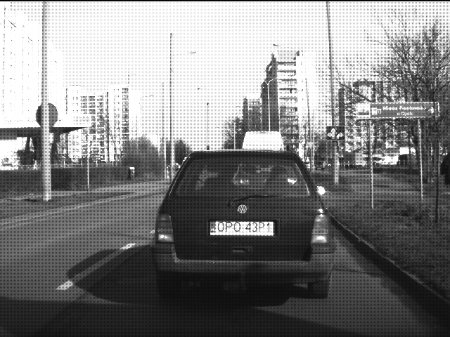
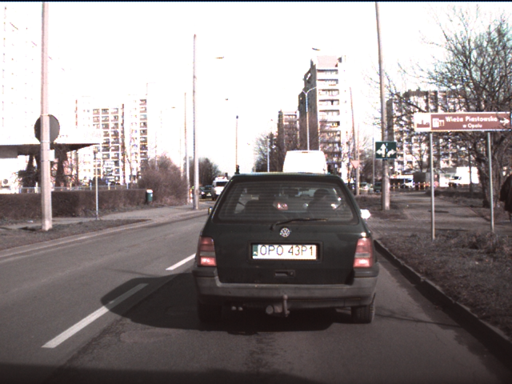
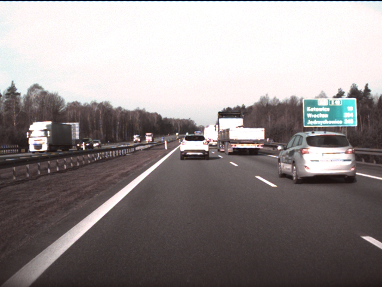
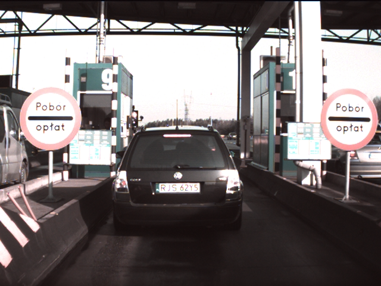

# Colored Video Compression
The current set of experiments were on video compression of the colored videos. The colored videos were obtained by demosaicing of the raw videos provided earlier. 
20 videos were demosaiced and then used for experimentation. We performed similar set of experiments, including trying out various quality values, different denoising filters etc.

## Demosaicing
There were some issues as discussed earlier. I am employing a hacky way right now to obtain the colored videos from the raw videos, as ffmpeg does not support an inbuilt demosaic filter. Currently using a matlab script to run image-by-image to convert the raw frames into colored ones. Also, need to adjust the gain factors by trial-and-error to get the color more realistic. This should afect the color to some extent, but the compression results, I think should not matter much. 

Some examples of the demosaiced frames are below. Clearly, there seems to be lot of saturation in the frames (which might be a result of low-quality demosaicing). Which can be improved. On another note, better cameras, more fine-tuned for autonomous driving with non-Bayer arrangement can be possibly used.

1. Raw Frame

2. Demosaiced frames

The results are summarised below:
## Experiments

### File Size Experiment
We experimented on 80 videos of approximate size of 650MB raw videos each. (Total 52GB).

After demosaicing (leading to some size reduction of 0.75 approximately), the average file sizes were:

codec | raw | x264 | x265 | vp9
--- | --- | --- | --- | ---
size  | 650M | 42M   | 43M   | 43M

The file size logs are added to the logs/ford_logs/
### Denoise Experiment
We tested with a few filters (most of them state-of-the-art). Which include hqdn3d, and its various variants based on spatial and temporal settings.
Also planning to test out the new NLMeans denoiser. However, which exact denoiser to use can be decided after consultation with the computer vision team. 

1. Hqdn3d with conservative settings 

As we observe, the difference becomes less pronounced as the CRF level increases. This is expected, considering lossy versions would try to remove unwanted noise first. But, CRF levels should not be direclty compared here, as they are relative to lossless version which would for sure be much better for the denoised video.

