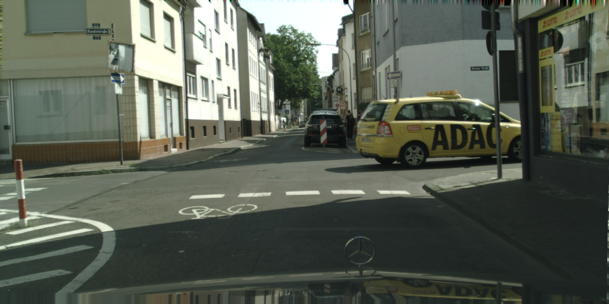
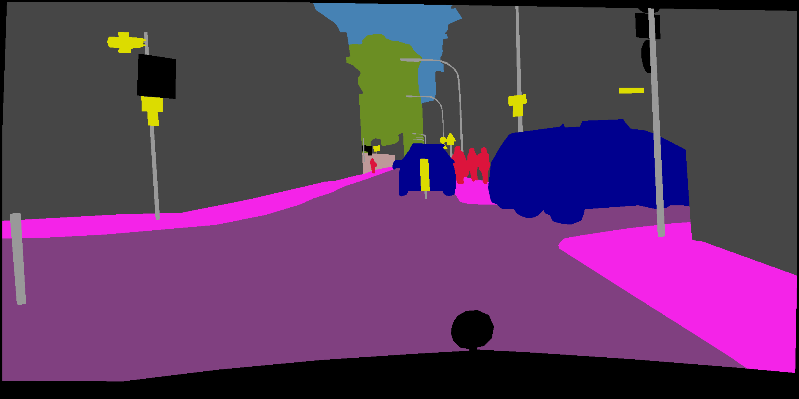

# Cityscape Experiments
These are the results of the experiments with the cityscape dataset.

The experiments were conducted with the frankfurt part of the cityscape dataset.
## Dataset

1. The Frankfurt dataset contains around 80,000 frames, consisting of 3 stages (which we will refer to as long stages)
This part of the dataset was used mainly for compression experiments, as ground truth is not available for ll the frames.
2. A subset of the Frankfurt dataset: 50 sequences of 30 frames each, was used for majority of the experiments. 
Every 20th frame in the 30 frame have ground truth pixel-level object segmentation information 
(both object type and class information).

Sample (frame): 

Sample ground truth:

## Experiments
1. **Compression vs distortion experient**
2. **Impact of denoising**
3. **Optical Flow experiments**
4. **Object Detection/Segmentation experiment**

The raw results are in the logs folder. While all the scripts are in the main folder. 

1. [logs](logs): contains logs
2. [create_videos.sh](create_videos.sh): Script for creating videos from consecutive frames
3. [retrieve_frames.sh](retrieve_frames.sh): Retrieve the 20th frame (and 19th frame) for experiments and comparison with ground truth
4. [run_obj_detect.sh](run_obj_detect.sh): Run object detection experiment which compares the result with the GT. We use the the [LRR](https://github.com/golnazghiasi/LRR) (Laplacian Pyramid Reconstruction and Refinement for Semantic Segmentation) algorithm, one of the best amongst the benchmarks on the Cityscape datasets.
5. [run_opt_flow.sh](run_opt_flow.sh): Run the Farneback optical flow algorithm on a specific codec and crf values mentioned in the config.ini file
6. [run_opt_flow_deepFlow2.sh](run_opt_flow_deepFlow2.sh): Run the DeepFLow2 optical flow algorithm

### Compression vs distortion experiment (Total memory for 50 videos together)
These results are for 30 frame snippets (average over 50 snippets)
The original dataset is in the form of png images and has average size of 70MB.

CRF| x264 |x265 | vp9
--- | --- | --- | ---
crf0| 44M | 53M | 48M
crf2| 31M | 20M | 20M
crf4| 24M | 16M | 12M
crf6| 19M | 12M | 8.5M
crf8| 16M | 9M | 6.2M
crf16| 5M | 2.5M | 3.1M
crf24| 1.5M | 0.8M | 2.1M

The speeds of compression are as follows:
Speed |x264|x265|vp9
---|---|---|---
in fps| 5.5 | 1.3 | 0.2

#### Compression experiment for longer duration videos 
These experiments are for 5min video blocks (5100 frames at 17fps)

CRF| x264 
--- | ---  
crf0| 7.2GB 
crf8| 2.35GB 
crf16| 560MB
crf24| 150MB 

(per frame wise: This is better than 30 frame compression by: 20-25%)

#### Compression with presets:
I used a veryslow preset to check what is the best quality achievable on x264. I ran this both on long as well as short videos.

CRF| x264 |x264(veryslow preset)
--- | --- | ---
crf0| 44M | 43.6M 
crf2| 31M | 28.8M
crf4| 24M | 23.1M
crf6| 19M | 17.7M
crf8| 16M | 13.2M
crf16| 5M | 3.36M
crf24| 1.5M | 1M

For 5min videos, similar trend is observed (5100 frames).

CRF| x264 | x264 (veryslow preset)
--- | ---  | ---
crf0| 7.2GB | 7.1GB
crf8| 2.35GB | 2.1GB
crf16| 560MB | 341MB
crf24| 150MB | 95MB

### CRF0 Difference Analysis
During the last discussion, we noticed that x265 CRF0 results were different that x264. I checked into this issue, and seems the difference is with respect to x265 codec usage. For almost all other codecs: x264,vp9,vp8,ffv1 etc. "-crf 0 or -qp 0" denotes perfectly lossless over the YUV space. For x265, it still performs transform coding, and then is lossless after that for "-crf 0". I switched off the transform coding and performed the experiments again, and the results are the same as x264, vp9. To be sue, I also used framehash, to compare hash values for each and every frame fro all the three codecs, and the hash values are exactly the same.
The log files for the hash values can be accessed here: (these are for the first video only)

1. [default_hash](logs/lossless_hash/default_hash.txt): The hash for the original png frames converted to YUV444 format
2. [x264_hash](logs/lossless_hash/x264_framehash.txt): x264 hash 
3. [x265_hash](logs/lossless_hash/x265_framehash.txt): x265 hash
4. [vp9_hash](logs/lossless_hash/vp9_framehash.txt): vp9 hash

Note that although these are perfectly the same after conversion to YUV444, there is still some loss in conversion from rGB (in which the original frames are provided) to YUV444. I also checked for the amount of loss this incurs, and this is about 0.2% RMSE error.

### Optical Flow experiments
For fair comparison, we only consider dense optical flow algorithms (as it is unclear how should we compare feature-based optical flow algorithms). Attempted the following Optical Flow algorithms. However, was able to successfully conduct the **Farneback's algorithm.**

1. [Farneback's Algorithm](http://docs.opencv.org/2.4/modules/video/doc/motion_analysis_and_object_tracking.html): The results are for this algorithm (openCV implementation)

CRF| x264 |x265 | vp9
--- | --- | --- | ---
crf0| 0.000 | 0.000 | 0.000
crf2| 0.022 | 0.034 | 0.035
crf4| 0.027 | 0.042 | 0.047
crf6| 0.032 | 0.052 | 0.057
crf8| 0.038 | 0.064 | 0.079
crf16| 0.082 | 0.122 | 0.122
crf24| 0.310 | 0.210 | 0.147

2. [DeepFLow2](http://thoth.inrialpes.fr/src/deepflow/): The results are shown below:

CRF| x264 |x265 | vp9
--- | --- | --- | ---
crf0| 0.000 | 0.000 | 0.000
crf2| 0.013 | 0.024 | 0.019
crf4| 0.017 | 0.028 | 0.030
crf6| 0.022 | 0.035 | 0.037
crf8| 0.027 | 0.040 | 0.053
crf16| 0.056 | 0.071 | 0.752
crf24| 0.12 | 0.132 | 0.090

4. [EpicFLow](http://thoth.inrialpes.fr/src/epicflow/): TBD
3. [SimpleFlow](http://graphics.berkeley.edu/papers/Tao-SAN-2012-05/): For some frames (even lossless, gives incorrect flow (nan), and is probably unreliable

### Object Detection/Segmentation experiment

Algorithms used:

1. [LRR](https://github.com/golnazghiasi/LRR): (Laplacian Pyramid Reconstruction and Refinement for Semantic Segmentation) algorithm, one of the best amongst the benchmarks on the Cityscape datasets.

##### x264
CRF|meanIU |pixelAcc | meanAcc
--- | --- | --- | ---
crf0|71.27| 95.04 | 82.07 
crf2|71.24| 95.03 | 82.09 
crf4|71.27|95.02 | 82.09
crf6|71.14|95.01 | 82.05
crf8|70.86 | 94.97 | 81.70
crf16| 70.32 | 94.69 | 81.27
crf24| 62.17 | 90.66 | 77.79

#####x265
CRF|meanIU |pixelAcc | meanAcc
--- | --- | --- | ---
crf0|71.27| 95.04 | 82.07 
crf2|71.23| 95.04 | 81.09 
crf4|71.16|95.00 | 81.76
crf6|71.18|94.96 | 81.76
crf8|70.58 | 94.87 | 81.26
crf16| 69.38 | 94.29 | 80.36
crf24| 60.79 | 90.64 | 74.39

#####VP9
CRF|meanIU |pixelAcc | meanAcc
--- | --- | --- | ---
crf0|71.27| 95.04 | 82.07 
crf2|71.10| 94.97 | 81.96 
crf4|70.30| 94.71 | 81.32
crf6|69.58 | 94.45 | 80.93
crf8|67.34| 93.21| 80.09
crf16|65.67| 93.21 | 80.09
crf24| 63.95| 90.73 | 78.63

The relevant parameters are:

1. **meanIU:** mean intersection-over-union metric [IoU](https://www.cityscapes-dataset.com/benchmarks/) 
2. **pixelAcc:** Pixel Level Accuracy
3. **meanAcc:** Average Accuracy 

### Impact of denoising
There is approximately 20-25% saving on denoising, with very less impact on algorithms.

##### FileSizes
CRF| x264 |x264_denoise
--- | --- | --- 
crf0| 44M | 32M  
crf8| 16M | 12M
crf16| 5M | 3.8M
crf24| 1.5M | 1.3M

Its observed that the specific hqdn3d denoiser does not result in significant gains (as compared with the experiments with Ford videos). Probably different denoiser might work. Also, the noise seems really low in the videos

##### Farneback Optical Flow
CRF| x264 |denoise_x264
--- | --- | ---
crf0| 0 | 0 
crf8| 0.038 | 0.040
crf16| 0.081 | 0.080
crf24| 0.185 | 0.16
crf32| 0.31 | 0.28 

##### DeepFlow2 Optical Flow
CRF| x264 |denoise_x264
--- | --- | ---
crf0| 0 | 0 
crf8| 0.027 | -
crf16| 0.056 | -
crf24| 0.123 | -
crf32| 0.28 | -

### TODO
1. CRF0 obj detection check
2. multipass ffmpeg compression
