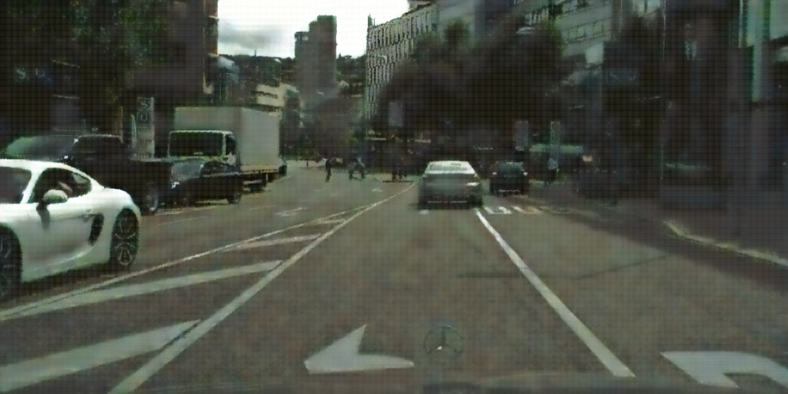
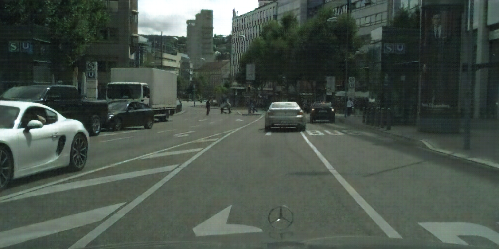
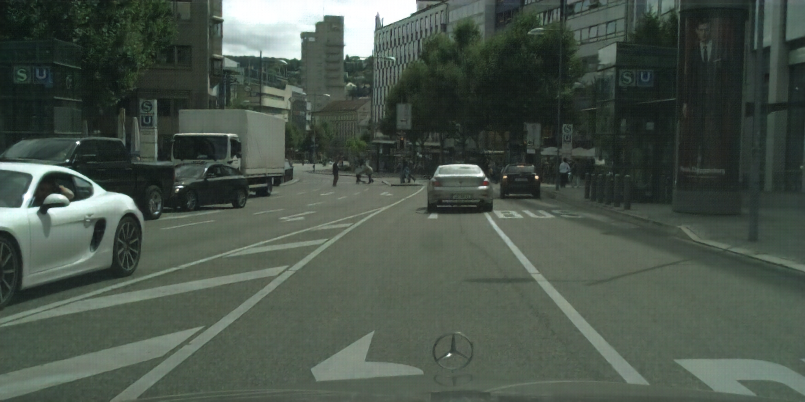
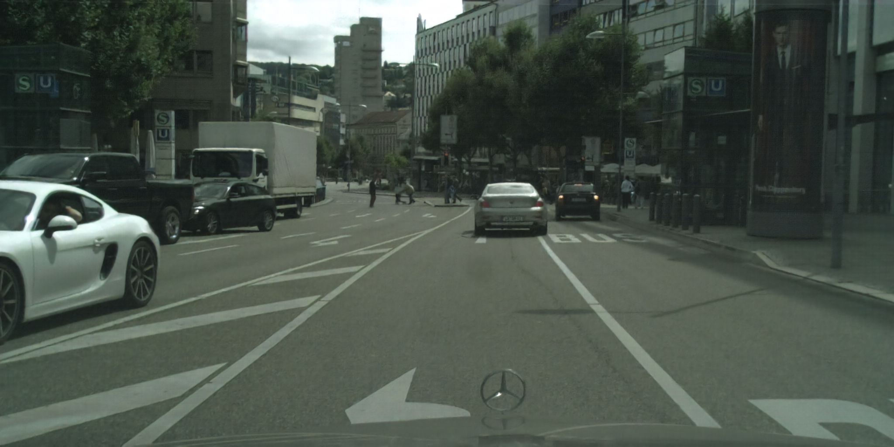
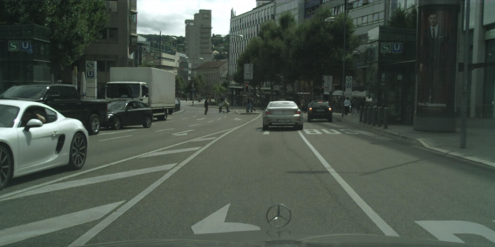

## Introduction
This is a summary of experiments on the google tensorflow image compressor. One of the aims is to adapt it for video data with different loss functions (loss functions more suitable for autonomous driving: eg: optical flow based loss function).

### Intuition
The Encoder processes blocks of 32x32 and performs "conceptual compression" of the block. Every block is compressed using the other neighboring blocks as priors, using the gated recurrent units (a slightly modified form of RNN). For speed They also add residual connections, but I dont think this makes mcuh of an impact on the understanding. But, probably allows deeper networks in practice. 

Both the decoder and encoder networks are trained together (unlike autoencoders, they need not be the same). As described in the paer & the blog (https://research.googleblog.com/2016/09/image-compression-with-neural-networks.html):

1. The initial residual, R[0], corresponds to the original image I: R[0] = I.
2. Set i=1 for to the first iteration.
3. Iteration[i] takes R[i-1] as input and runs the encoder and binarizer to compress the image into B[i].
4. Iteration[i] runs the decoder on B[i] to generate a reconstructed image P[i].
5. The residual for Iteration[i] is calculated: R[i] = I - P[i].
6. Set i=i+1 and go to Step 3 (up to the desired number of iterations).
 
The compressed image is now represented by the concatenation of B[1] through B[N]
Thus, the size linearly increases with number of iterations. 

### Improvements
With the perspective of video compression, we can at least improve the compression ratio by approximately saving a couple iteration of data (practically this should be about 10%-20%), by using motion vector predicted frame (coarse prediction). Thus, we extract one part of the video codecs & directly reuse it.
 
##Experiments
### Experiment 1
This was mainly about getting the code to work. There have been some issues, for which I have raised an issue on the google github repo: (https://github.com/tensorflow/models/issues/704). Right now working with some workarounds. 

Performance: 
1. Input Image 
	- Size: 
	- 

2. Output Image 
	- Number of iterations: 
	- Size: 
	- Quality (with msssi quality metric)
	  (https://ece.uwaterloo.ca/~z70wang/publications/msssim.html)

We take a look at images for 5 iterations:

### Experiment 2
This experiment was on the videos, by directly feeding in image samples. We use 5 iterations for simplicity right now (the computations are linear in number of iterations, and take a lot of time).

### Experiment 3
This experiment was by feeding direct differences of frames (and not motion vector adjusted differences)

### Experiment 4(TODO)
Motion vector adjusted difference (TODO)

### Optical Flow Experiment(TODO)
Check at what iterations, do optical flow results look good. (Assuming the same loss function for which the network is trained for). 

##Challenges
There are some important constraints, which might take a bit of time to resolve.

1. We would like to train the network with different loss functions. However, the training procedure has not been provided, so that would have to be written from scratch.
2. Currently, only CPU versions are working so running/implementation takes a bit of time.

 
